# 🚨 CrisesMesh AI — Multi-Crisis Management Command Center for Pakistan

<div align="center">

[](https://muneeb785-crisesmesh-ai.hf.space)
[](https://muneeb785-crisesmesh-ai.hf.space)
[](https://expo.dev/accounts/muneeb785/projects/crisesmesh-ai/builds/d2e8b67f-e9be-4ad8-9931-34c29671183a)
[](https://ai.google.dev/)
[](#7-antigravity-development-time-evidence)

A dual-interface mobile crisis management system designed for Pakistan's urban centers. It enables citizens to report urban flooding instantly and empowers government responders to verify crisis signals, auto-allocate rescue resources, simulate route optimizations, and coordinate public safety notifications using an advanced multi-agent AI pipeline.

</div>

---

## 🎥 Project Demonstration & AI Agent in Action

To experience the full capabilities of **CrisesMesh AI**, check out our project demonstration and see how our developer assistant, Google Antigravity, brought this application to life:

| Video | Link | Description |
|---|---|---|
| **🎥 Live Application Demonstration** | [Watch Demo Video](https://youtu.be/o7Q-W_RXdaA) | End-to-end walkthrough showing Citizen Reporting, AI Signal Ingestion, Government Command Center, Reroute Simulator, and Alert Approval. |
| **🤖 Google Antigravity Usage Pitch** | [Watch Antigravity Usage Video](https://youtu.be/Ts7licb1wIs) | Behind-the-scenes recording showing how Google Antigravity autonomously debugged, compiled, solved environment issues, and deployed the app. |

---

## 🚀 Live Production Deployment

The project has been fully built, packaged, and deployed to live production servers:

* **Live Backend API**: [https://muneeb785-crisesmesh-ai.hf.space](https://muneeb785-crisesmesh-ai.hf.space)
* **Live Health Check**: [Health Status Endpoint](https://muneeb785-crisesmesh-ai.hf.space/health)
* **Android APK Installation**: [Download Android APK via EAS](https://expo.dev/accounts/muneeb785/projects/crisesmesh-ai/builds/d2e8b67f-e9be-4ad8-9931-34c29671183a) (Scan the QR Code on your Android device to install the application instantly).

---

## 1. Problem Statement

Pakistani cities face severe urban challenges, particularly during the monsoon season. Fragmented crisis signals, delayed manual verification, and uncoordinated emergency response lead to catastrophic urban flooding and gridlock.
- **Fragmented signals**: Citizen complaints, social media feeds, weather sensors, and emergency calls operate in isolated siloes.
- **Delayed verification**: First responders are sent without accurate prioritization, leading to precious time lost.
- **Limited resources**: Rescue teams, water pumps, and ambulances are allocated inefficiently.
- **Coordination gap**: Public safety alerts are slow to reach affected populations, lacking localized, bilingual, and actionable instructions.

**CrisesMesh AI** bridges this gap with an AI-agent-orchestrated, dual-interface mobile application, focusing its MVP on **Urban Flooding** in the twin cities of **Islamabad and Rawalpindi** (particularly focusing on flood-prone zones like Nullah Lai, G-10 Underpass, and surrounding areas).

---

## 2. Solution Overview

CrisesMesh AI provides a single dual-interface mobile application that caters to both the public (**Citizen Module**) and first responders (**Government Command Center Module**).

### Citizen Side
- **Report Emergency**: Report flooding, waterlogging, or drain blockage with Roman Urdu/English text, photos, and voice notes.
- **Auto-GPS Location**: Captures exact location with interactive map pin correction.
- **Real-time Safety Map**: Interactive visualization of Red Zones and safer detour routing.
- **Bilingual Alerts**: Visual and audible siren alerts with Urdu TTS warning near high-risk zones.

### Government Command Center
- **Crisis Sidebar**: A unified dashboard containing modules for Urban Flooding, Traffic Blockage, Power Outages, Disease Clusters, and more (with future modules locked as placeholders).
- **AI Signal Fusion**: Multi-signal ingestion fusing 7 signal sources into unified incident candidates.
- **Agent Trace Panel**: Transparent reasoning showing Signal Fusion, Severity, Resource Allocation, and Recovery Agent pipelines.
- **Simulation Console**: Pre-dispatch routing simulation assessing response times and alternate road congestion impacts.
- **Crisis Correction**: Incident reclassification (e.g. from Urban Flooding to local Water-Main Burst) and retraction of public warnings.

---

## 3. System Architecture

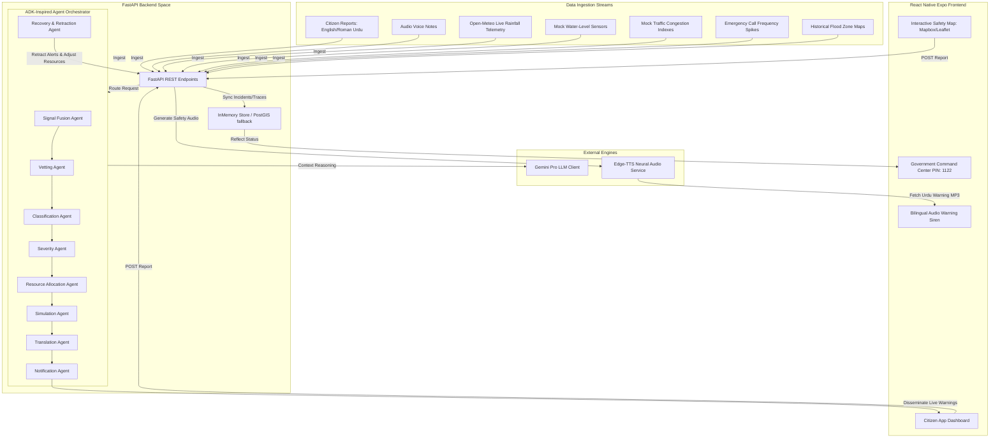

---

## 4. Key Features

### 4.1 Citizen Module
- **Onboarding**: Simple name and phone registration (mocked for demo).
- **Bilingual Form**: Accepts descriptions in English or Roman Urdu.
- **Voice Transcription**: In-app recording of voice descriptions and transcription.
- **Report Tracking**: Live status update from *Submitted* to *Under Review*, *Verified*, or *Resolved*.
- **Emergency Warnings**: Local siren warning and audio alarm triggered when entering high-risk Mapbox Red Zones.
- **Simulated Preview**: WhatsApp and SMS alert preview generated automatically for citizens.

### 4.2 Government Command Center
- **Command Access**: Secured demo PIN (`1122`) to access the Command Center.
- **Visual Alert Map**: Interactive Leaflet maps highlighting active threat spheres and signal markers.
- **Dynamic Prioritizer**: Automatically calculates severity index and priority rating from fused inputs.
- **AI Resource Dispatch**: Generates allocation recommendations for rescue squads, ambulances, police, and water-pumps.
- **Traffic Reroute Simulator**: Computes optimal paths, ETA improvements, and secondary road congestion.
- **Alert Drafting & Approval**: Automatically drafts alerts in English and Roman Urdu, requiring human command confirmation before publishing.
- **Bilingual Notification Pipeline**: Seamless alert dissemination to the Citizen Module.
- **Conflict & Reclassification**: Downgrades and retracts alerts if field reports contradict initial sensor data (e.g., local pipe burst instead of city-wide flooding).

### 4.3 Scalable Multi-Crisis Command Structure
The Command Center features a scalable sidebar showcasing unified emergency management capability:
- **Urban Flooding** (Fully Functional MVP)
- **Traffic Blockage** (Future Module Placeholder)
- **Heat Emergency** (Future Module Placeholder)
- **Power Outage** (Future Module Placeholder)
- **Disease Cluster** (Future Module Placeholder)
- **Public Disorder** (Future Module Placeholder)
- **Infrastructure Failure** (Future Module Placeholder)

Clicking on future modules displays a scalable roadmap message, proving architectural readiness for full multi-crisis deployment.

---

## 5. Challenge Requirement Mapping

| Hackathon Requirement | CrisesMesh AI Implementation |
|---|---|
| **Mandatory Mobile App** | React Native + Expo Mobile Application running on Android, iOS, and Web. |
| **Multi-Signal Fusion** | Ingests 7 distinct signal sources: citizen reports, weather forecasts, traffic indexes, water sensors, field reports, historical flood zones, and emergency calls. |
| **Crisis Classification** | Classification Agent identifies incident type and maps alternative hypotheses with confidence. |
| **Location & Affected Area** | Leaflet-based interactive overlay displaying circular/polygon Red Zones and threat scopes. |
| **Severity Prediction** | Severity Agent calculates affected radius, estimated population, peak impact time, and duration. |
| **Resource Allocation** | Resource Allocation Agent recommends optimized rescue units, ambulances, and pumps with trade-off logs. |
| **Multi-Crisis Coordination** | Interactive sidebar highlighting functional Urban Flooding and future system expansions. |
| **Impact Simulation** | Simulation Agent computes unsafe vs safe route ETAs and secondary congestion side effects. |
| **Stakeholder Notification** | Public broadcasts (English + Roman Urdu), rescue notices, utility alerts, and hospital advisories. |
| **False Positive / Recovery** | Recovery Agent handles field overrides, retracts public alerts, and adjusts allocations. |
| **Robustness / Degraded Mode** | In-memory store fallback, stale sensor warnings, and graceful UI degrade if services are down. |
| **Antigravity Traces** | Trace logs, generated artifacts, screenshots, and recording files in `antigravity-evidence/`. |

---

## 6. Runtime Agent Workflow (9-Agent Architecture)

CrisesMesh AI is orchestrated by an **8-Agent Sequential Pipeline** plus a standalone **Recovery Agent** to manage verifying, dispatches, alert publishing, and emergency retraction:

```text
Incoming Incident
  │
  ▼
1. Signal Fusion Agent (Fuses 7 telemetry streams)
  │
  ▼
2. Vetting Agent (Scores report reliability and verifies indicators)
  │
  ▼
3. Classification Agent (Identifies crisis type & lists alternative hypotheses)
  │
  ▼
4. Severity Agent (Predicts impact radius, duration, and peak impact time)
  │
  ▼
5. Resource Allocation Agent (Assigns rescue teams, water pumps & ambulances)
  │
  ▼
6. Simulation Agent (Calculates detour routing & secondary congestion ETAs)
  │
  ▼
7. Translation Agent (Generates bilingual notifications in EN & Roman Urdu)
  │
  ▼
8. Notification Agent (Structures target notices for rescue, hospital & public channels)
  │
  ▼
Public Alert Approved by Command Center ──► Alerts broadcasted to Citizen Apps
  │
  ▼
9. Recovery Agent (Monitors field officer reports to trigger retractions & reclassifications)
```

### 6.1 Agent Specifications

#### 1. Signal Fusion Agent (`signal_fusion.py`)
- **Input**: 7 raw streams (Citizen descriptions, Open-Meteo Live Rainfall, Traffic Congestion, Water Hydro-sensors, Emergency Call logs, Historical maps, Field Officer reports).
- **Responsibility**: Correlates dates/times, deduplicates repetitive user reports, matches geo-coordinates, and fuses data.
- **Output**: Fused Incident Candidate JSON containing the signal agreement index and spatial centroids.

#### 2. Vetting Agent (`vetting.py`)
- **Input**: Fused Incident Candidate + raw signals.
- **Responsibility**: Checks if citizen-reported descriptions align with sensor readouts and live weather data.
- **Output**: Confidence score (0.00 to 1.00) and indicator audit flags.

#### 3. Classification Agent (`classification.py`)
- **Input**: Vetted Incident Candidate.
- **Responsibility**: Identifies the primary category of crisis (e.g. *Urban Flooding*).
- **Output**: Primary Classification, alternative hypotheses, and classification confidence logs.

#### 4. Severity Agent (`severity.py`)
- **Input**: Classified Incident & Open-Meteo Weather telemetry.
- **Responsibility**: Estimates the scale of the emergency.
- **Output**: Severity Level (*Critical*, *High*, *Medium*, *Low*), affected radius (in meters), estimated population at risk, expected duration (in hours), and peak impact time.

#### 5. Resource Allocation Agent (`resource_allocation.py`)
- **Input**: Incident Details, Priority Score, and resource database schemas.
- **Responsibility**: Allocates rescue squads, water pumps, ambulances, and police units efficiently.
- **Output**: Recommended dispatch assets, along with reasoning logs highlighting trade-offs (e.g., matching capacity to the threat radius).

#### 6. Simulation Agent (`simulation.py`)
- **Input**: Incident coordinates, unsafe route vectors, Mapbox spatial routing datasets.
- **Responsibility**: Runs dispatch route simulation. Compare normal paths to safe detour paths avoiding the flooded zone.
- **Output**: Unsafe route ETA, safe route ETA, percent travel time change, and secondary road congestion impact factors.

#### 7. Translation Agent (`translation.py`)
- **Input**: Fused and analyzed crisis data.
- **Responsibility**: Dynamically translates notifications to guarantee clear instructions reach the public in English and Roman Urdu.
- **Output**: Translated message strings.

#### 8. Notification Agent (`notification.py`)
- **Input**: English/Urdu translation strings.
- **Responsibility**: Formulates targeted alert payloads.
- **Output**: Four customized notifications: Public Safety Notice, Rescue Briefing, Hospital Alert, and Utility Provider warning.

#### 9. Recovery Agent (`recovery.py`)
- **Input**: Field officer report overrides (e.g., "The flooding is actually a local water-main burst, not rain-driven").
- **Responsibility**: Identifies conflicts, triggers incident downgrade, corrects resource allocation, and drafts public retractions.
- **Output**: Retraction Alert payload, corrected classification, and downgraded resource recommendations.

---

## 7. Antigravity Development-Time Evidence

During the development of **CrisesMesh AI**, **Google Antigravity** served as our autonomous engineering assistant. It handled file creation, linting fixes, dependency resolution, video voiceover editing, and live deployment.

All traces, logs, and screenshots are preserved under `antigravity-evidence/`:
* **`traces/`**: Chronological plan executions detailing how the FastAPI backend and Expo app was written and debugged.
* **`screenshots/`**: High-quality visual evidence of UI screens, command center panels, and mobile modules.
* **`prompts/`**: Reusable system instructions for AI pipelines.
* **`test-logs/`**: System test output logs verifying health check and routing APIs.
* **`demo-recordings/`**: Automated webp video logs showing working user flows.

> [!NOTE]
> Antigravity is strictly a development-time environment orchestrator. All runtime decisions in production are handled by FastAPI, custom Python agents, and the Gemini API.

---

## 8. Data Sources

### 8.1 Real-Time Sources
- **Mapbox**: Map styling, route coordinates, and ETA proxy computations.
- **Open-Meteo API**: Live rainfall (mm) and temperature telemetry near Islamabad.

### 8.2 Mock Streams (MVP Controlled Demo)
- **Citizen Report Stream**: Simulated incoming alerts.
- **Water-Level Sensors**: Simulated G-10 Underpass hydro-sensors.
- **Emergency Call Logs**: Automated emergency volume spikes.
- **Historical Vulnerability Index**: Predefined flood zones in twin cities.
- **Field Officer Reports**: On-site verification feeds.

---

## 9. Urban Flooding Demo Scenario

The end-to-end hackathon demonstration follows a realistic crisis scenario in Islamabad:

1. **Reporting**: A citizen files an emergency report of rising water levels at the **G-10 Underpass, Islamabad**.
2. **Signal Ingestion**: The system pulls 7 signals: citizen's report, live rainfall data showing heavy monsoon, traffic congestion on adjacent highways, rising water sensor logs, high emergency call volumes, historical flooding profiles, and field telemetry.
3. **AI Reasoning**: The Signal Fusion, Classification, and Severity agents compile the data. The incident is classified as **Urban Flooding - Critical** with a priority score of **95/100**.
4. **Command Console**: Responders verify the incident in the Government Command Center.
5. **Resource Dispatch**: The AI suggests deploying 4 Rescue Teams, 2 Ambulances, 3 Police Units, and 4 Water Pumps. The coordinator reviews and approves the dispatch.
6. **Simulation**: The operator runs a reroute simulation showing a safe detour route avoiding the flooded G-10 underpass, showing response time improvement.
7. **Draft Alerts**: The Notification Agent drafts alerts in English and Roman Urdu.
8. **Alert Push**: The coordinator approves and publishes the alerts, propagating them instantly to all active Citizen apps in the vicinity.
9. **Siren Warning**: A simulated citizen near the G-10 underpass receives the warning and hears an audible siren along with a Roman Urdu TTS warning.
10. **Crisis Recovery**: A field officer inspects the underpass and reports that the flooding is actually due to a localized **Water-Main Burst**, not widespread rain overflow.
11. **System Adaptation**: The government triggers a recovery review. The Recovery Agent reclassifies the incident, updates the resource dispatch, retracts the public flood warning, and dispatches sewerage/utility teams.

---

## 10. Tech Stack

| Layer | Technology |
|---|---|
| **Mobile App** | React Native, Expo (SDK 54), TypeScript |
| **Styling** | NativeWind, Vanilla CSS |
| **Maps** | Leaflet.js HTML overlay via WebViews |
| **Backend** | FastAPI, Python (Uvicorn) |
| **AI Framework** | Google ADK / Gemini API |
| **Audio Services** | Edge-TTS (Microsoft Neural Voices - `en-US-BrianNeural`) |
| **Database** | Supabase / Thread-safe In-Memory fallback |
| **Telemetry** | Open-Meteo Weather APIs |

---

## 11. Database Overview

The system includes pre-configured database structures (seed scripts available in `backend/migrations/`):
- `citizen_reports`: Tracking reports submitted by the public.
- `signals`: Recording active telemetry, sensor alerts, and citizen complaints.
- `incidents`: Tracking verified, candidate, and reclassified crises.
- `resources`: Master database of rescue assets, water-pumps, and ambulances.
- `resource_allocations`: Mappings of dispatched resources to active crises.
- `agent_traces`: Storing reasoning steps, logs, and outputs from AI pipelines.
- `alerts`: Storing approved public broadcasts and warning states.

---

## 12. API Overview

- **`POST /api/v1/citizen/reports`**: Submit citizen complaints.
- **`GET /api/v1/citizen/alerts`**: Pull active broadcast warnings.
- **`GET /api/v1/government/incidents`**: List active incident candidates.
- **`POST /api/v1/government/incidents/{id}/verify`**: Verify threat alerts.
- **`POST /api/v1/government/incidents/{id}/allocate-resources`**: Confirm resource dispatches.
- **`POST /api/v1/government/incidents/{id}/simulate-reroute`**: Execute route calculations.
- **`POST /api/v1/government/incidents/{id}/approve-alert`**: Confirm public notification draft.
- **`POST /api/v1/government/incidents/{id}/reclassify`**: Override classification (water-main burst flow).
- **`POST /api/v1/demo/start-flood-scenario`**: Initialize simulated monsoon flooding.
- **`POST /api/v1/demo/reset`**: Reset in-memory database storage.

---

## 13. Installation & Setup

### 13.1 Prerequisites
- **Node.js**: v18+
- **Python**: v3.11+
- **Package Manager**: npm

### 13.2 Backend Setup
1. Navigate to the backend directory:
   ```bash
   cd backend
   ```
2. Create and activate a virtual environment:
   ```bash
   py -m venv .venv
   .venv\Scripts\activate
   ```
3. Install required dependencies:
   ```bash
   .venv\Scripts\pip install fastapi uvicorn[standard] pydantic pydantic-settings python-dotenv python-multipart httpx edge-tts
   ```
4. Copy environment configuration:
   ```bash
   copy .env.example .env
   ```
5. Start the server:
   ```bash
   .venv\Scripts\python -m uvicorn app.main:app --port 8000 --host 127.0.0.1
   ```

### 13.3 Mobile Web Application Setup
1. Navigate to the mobile directory:
   ```bash
   cd mobile
   ```
2. Install packages:
   ```bash
   npm install
   ```
3. Start the dev server in Web mode:
   ```bash
   npm run web
   ```
4. Access the web interface in your browser: **`http://localhost:8081`**

### 13.4 Production Space Deployment (Hugging Face Docker)

CrisesMesh AI is fully Dockerized and hosted on Hugging Face Spaces using port 7860 binding.

To redeploy or update the live deployment:
1. Ensure your local files are in order.
2. In PowerShell, set your Hugging Face write token:
   ```powershell
   $env:HF_TOKEN="your_token"
   ```
3. Run the automated deployment script:
   ```powershell
   backend\.venv\Scripts\python.exe deploy_hf.py
   ```
4. The script copies the environment, bundles assets, and pushes directly to your Hugging Face space remote repository. The Space will automatically rebuild and go live.

---

## 14. Demo Credentials & Operation

- **Government PIN**: `1122`
- **Citizen Onboarding**: Any name and valid phone number.

### Operation Guide
1. Launch the web interface (`http://localhost:8081`) or open the Android APK.
2. Click **Continue as Citizen** and complete the onboarding step.
3. Submit a severe urban flooding complaint near **G-10 Underpass**.
4. Go back, select **Government Command Center**, and enter PIN `1122`.
5. Observe the active incident, trigger signal fusion, allocate recommended resources, run rerouting simulation, and approve the warning alert draft.
6. Toggle back to the **Citizen Module** and access **Live Alert Demo** to trigger siren and Urdu voice announcements.
7. Return to Command Center, click **Trigger Verification Conflict**, and experience the reclassification and retraction sequence.

---

## 15. Screenshots / Visual Evidence

Below is the verified end-to-end flow recorded during development:

### 15.1 Landing Screen
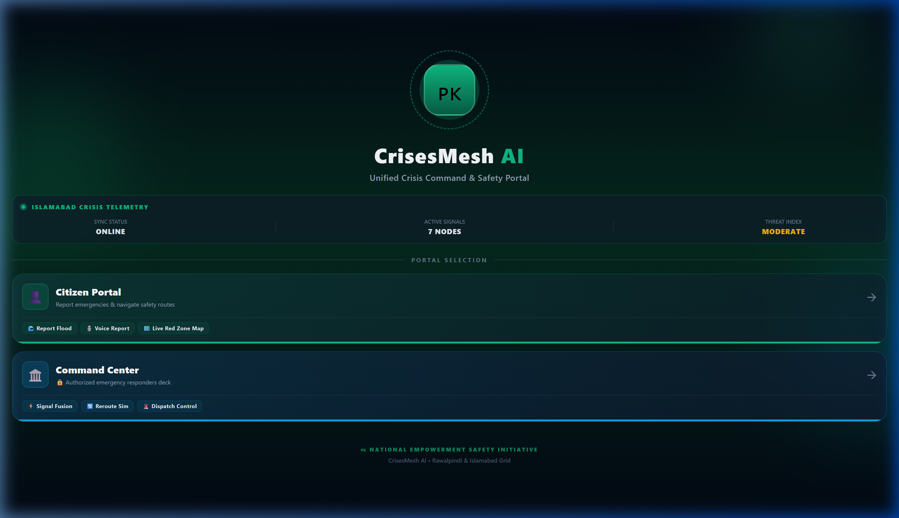

### 15.2 Citizen Onboarding & Home
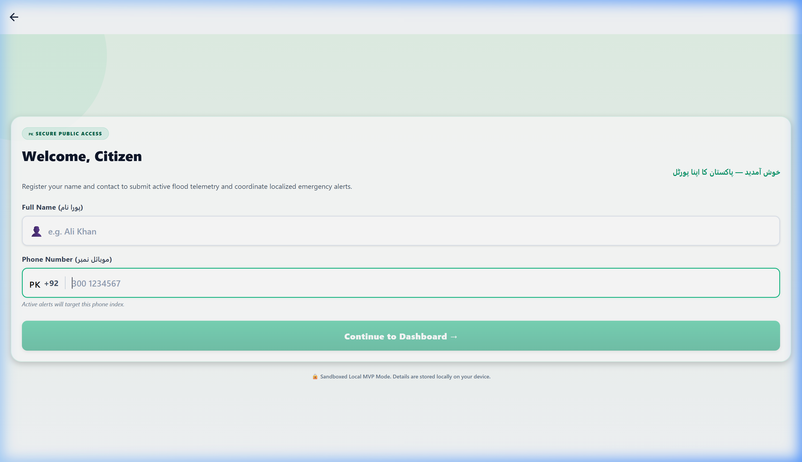
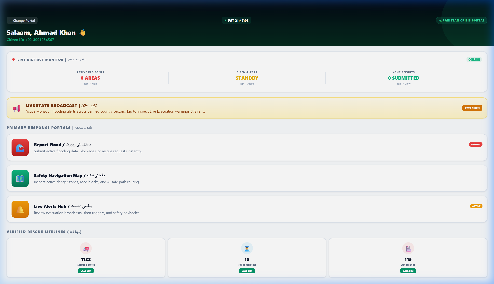

### 15.3 Emergency Reporting & Map Verification
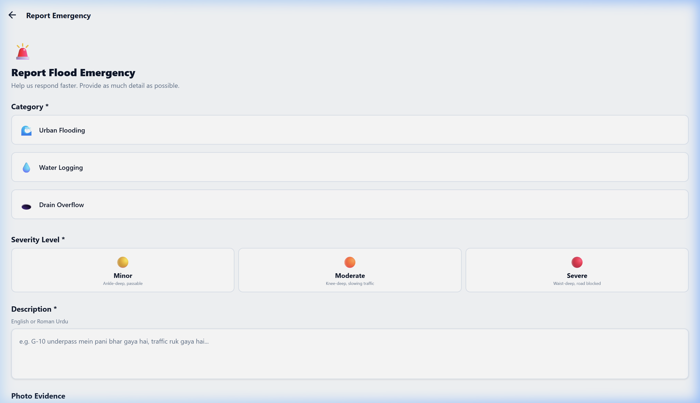
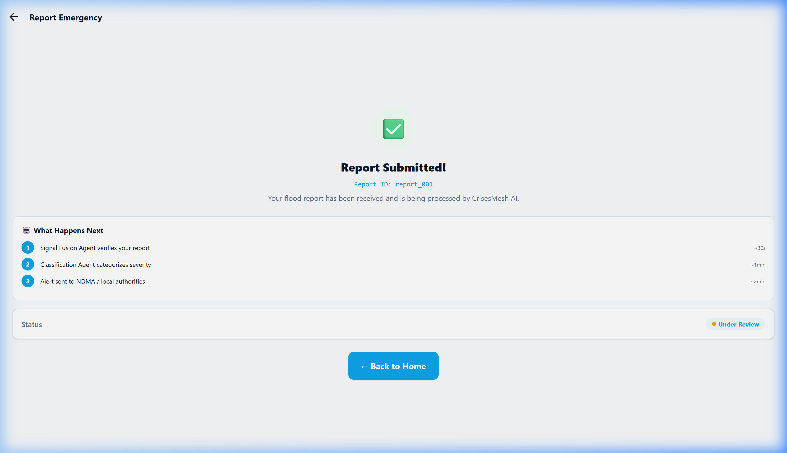
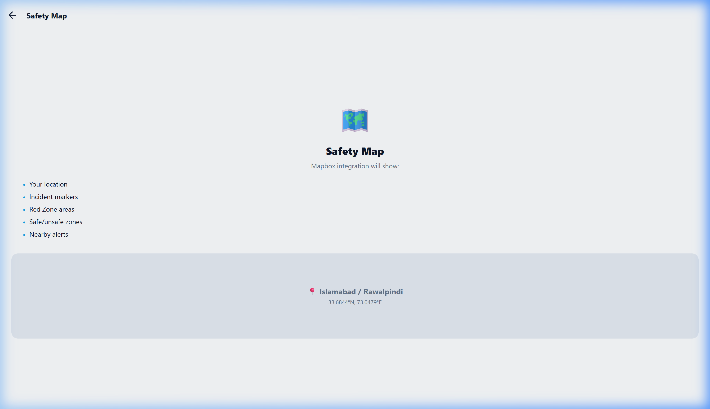

### 15.4 Government Command Center & Alert Dispatch
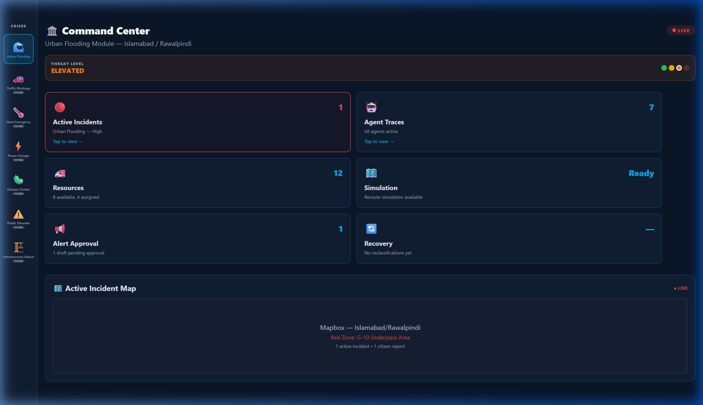
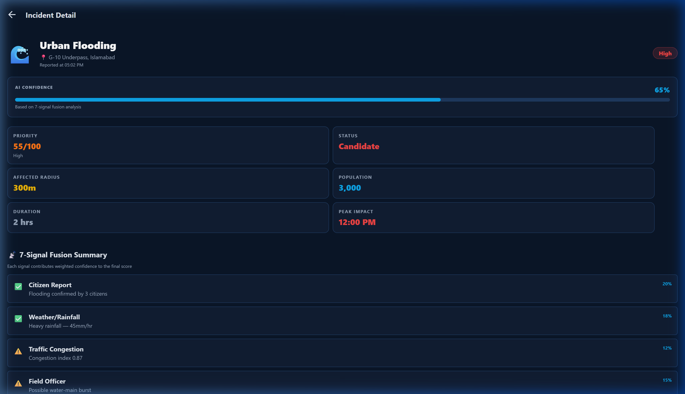
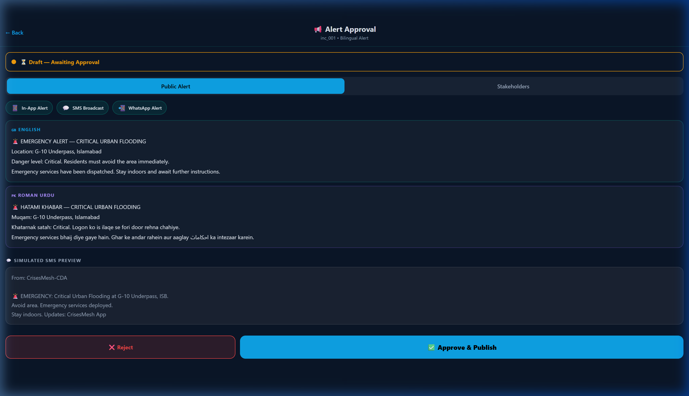
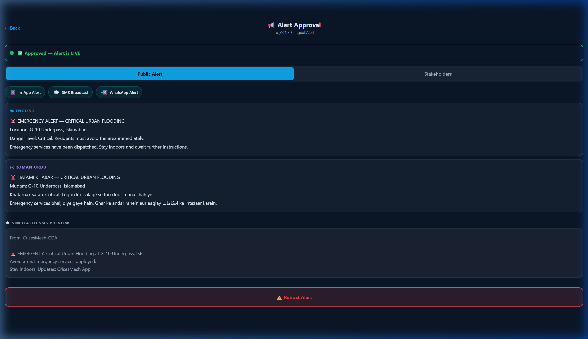

### 15.5 Real-Time Warnings Disseminated
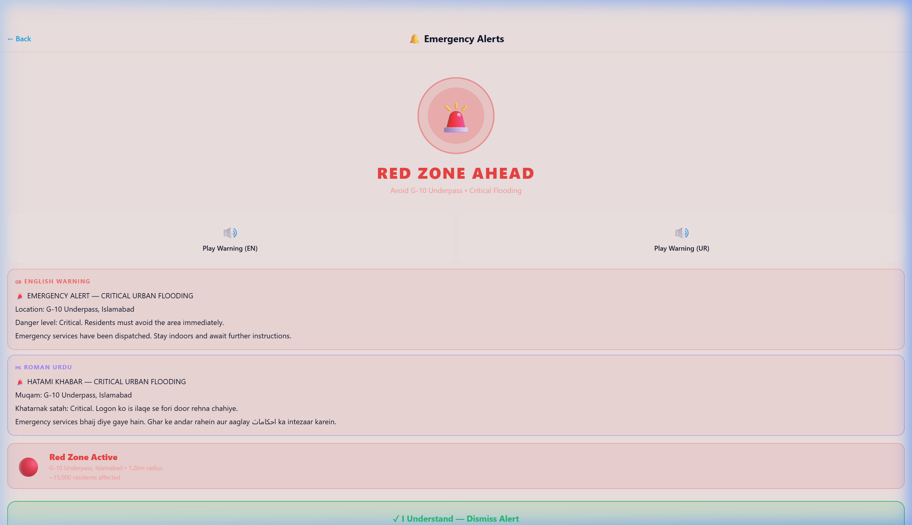

---

## 16. Cost, Latency, and Scalability

- **API Efficiency**: Uses targeted Gemini API prompts to maintain single-request reasoning.
- **Latency Benchmarks**:
  - Citizen report submission: `< 1.2` seconds.
  - Multi-agent fusion: `~3.5` seconds.
  - SMS/Bilingual broadcast generation: `< 2` seconds.
- **Scalability path**: The backend utilizes FastAPI's asynchronous routing structures, making it capable of handling thousands of concurrent citizen reporting feeds. Database scalability is fully supported using Supabase's geospatial index capabilities.

---

## 17. Governance, Safety, and Limitations

- **Human-in-the-Loop**: No alert can be broadcast publicly without physical government approval, mitigating fake-news or panic risks.
- **Data Protection**: Personal data is masked; reasoning structures inside trace pools only expose anonymous summaries.
- **MVP Boundaries**: Emergency dispatch, SMS/WhatsApp services, and non-flooding modules are simulated/pre-seeded to showcase core capabilities safely.

---

## 18. Roadmap & Scalability
- **Phase 1 (Done)**: Complete end-to-end Urban Flooding command slice.
- **Phase 2**: Implement real telemetry hooks (Pakistan Meteorological Dept APIs).
- **Phase 3**: Unlocking Traffic Blockage & Power Outage workflows.
- **Phase 4**: Integrating localized SMS gateways and municipal dashboard grids.

---

## 19. Final Pitch

**CrisesMesh AI** demonstrates how modern cities can transition from fragmented, reactive disaster handling to proactive, coordinated, and AI-supported crisis command. By unifying citizen telemetry with advanced reasoning agents, CrisesMesh AI saves critical minutes when every second counts.
