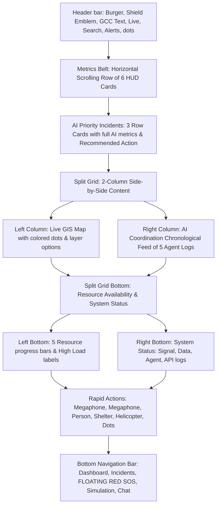

# 📋 Portrait Mobile Redesign Implementation Plan

This plan outlines the layout restructure of `mobile/src/screens/GovernmentHomeScreen.tsx` to match **each and every detail** of the high-fidelity portrait mockup `govt-command-Center.png` on mobile and tablet devices.

---

## 📐 SCREEN ARCHITECTURE & LAYOUT GRID

To map the high-density portrait interface onto a React Native viewport cleanly, we will design the screen to follow a **single vertical portrait ScrollView structure** using nested flexboxes rather than wide desktop rows.

---

## 🎨 COMPONENT SPECIFICATION BREAKDOWN

We will implement the following visual elements and data states in `GovernmentHomeScreen.tsx` to align exactly with the picture:

### 1. Global Navigation Header
*   **Emblem & Identity:** Render a hamburger menu icon, the official shield emblem inside a circular slate border, a bold title `GOVERNMENT COMMAND CENTER`, subtitle `Agentic AI Coordination System`, and a pulsing green `• Live` dot indicator.
*   **Header Shortcuts:** Add a magnifying glass search icon, a notification bell icon with a red badge containing the number `12`, and a three-dot options menu.

### 2. Metrics Belt (Horizontal Scroll)
*   Deploy a horizontal ScrollView containing exactly 6 cards with distinct colors, glowing borders, and specialized glowing vector-style icons:
    1.  **Red (Critical):** `3` Active Incidents (flashing bell).
    2.  **Orange (High):** `7` Incidents (target grid).
    3.  **Blue (Total Active):** `12` Total (shield).
    4.  **Green (Capacity):** `87%` Resource Load (capacity progress indicator).
    5.  **Purple (People):** `248K` People At Risk (wave sparkline).
    6.  **Light Blue (Score):** `72 / 100` Situation Score (wave sparkline).

### 3. AI Priority Incidents Block
*   Render a dense container with the title `AI PRIORITY INCIDENTS` and exactly 3 highly technical incident rows:
    *   **Row 1 (Urban Flooding):** Red number box `1` + water icon. Pill label `CRITICAL`. Coordinates: `G-10 Sector`.
        *   Parameters: Confidence `82%`, Severity `High` (Red), People at risk `98K`, ETA Peak `2.3 hrs`, Trend `Worsening ↑`, Duration `6-8 hrs`.
        *   AI Recommended Action: "Deploy Rescue Teams, Traffic Control" (Red text) + a glass-morphic `Quick Actions >` button.
    *   **Row 2 (Heat Emergency):** Orange number box `2` + thermometer icon. Pill label `CRITICAL`. Coordinates: `I-8 / Orangi Town`.
        *   Parameters: Confidence `84%`, Severity `Critical` (Orange), People at risk `76K`, ETA Peak `4.1 hrs`, Trend `Rising ↑`, Duration `12+ hrs`.
        *   AI Recommended Action: "Medical Outreach, Open Shelters" (Orange text) + `Quick Actions >` button.
    *   **Row 3 (Traffic Accident):** Blue number box `3` + car icon. Pill label `HIGH`. Coordinates: `Kashmir Highway`.
        *   Parameters: Confidence `62%`, Severity `Medium` (Yellow), People at risk `24K`, ETA Clearance `1.2 hrs`, Trend `Stable →` (Green), Duration `2-3 hrs`.
        *   AI Recommended Action: "Clear Route, Traffic Diversion" (Blue text) + `Quick Actions >` button.

### 4. Split Grid Middle Block (Side-by-Side Flex Columns)
*   **Left: Live Situational GIS Map**
    *   Header: `LIVE SITUATIONAL MAP` with blinking category dots: `Critical` (Red), `High` (Orange), `Medium` (Yellow), `Low` (Green).
    *   Responsive Leaflet GIS WebView centered around G-10 (Red danger circle) and I-8 (Orange danger circle) with floating layers, compass, and selector widgets.
*   **Right: AI Agent Coordination Feed**
    *   Header: `AI COORDINATION FEED` with green `Live` pill.
    *   Exactly 5 chronological agent logs showing agent titles, specific actions, timestamps, and glowing status bulbs (Severity Agent, Resource Allocator, Traffic Simulation Agent, Verification Agent, Communication Agent).
    *   Interactive `View All Activity >` link.

### 5. Split Grid Bottom Block
*   **Left: Resource Availability**
    *   Renders exactly 5 progress bar cards: Ambulances (`18 / 25`, Red progress/`High Load`), Rescue Teams (`32 / 45`, Orange progress/`High Load`), Police Units (`45 / 60`, Blue progress/`Medium Load`), Drones (`6 / 10`, Green progress/`Available`), and Shelters (`12 / 20`, Purple progress/`Available`).
*   **Right: System Status**
    *   Title `SYSTEM STATUS` with green indicator `All Systems Operational ●`.
    *   Progress bars for: Signal Integrity (`94%`), Data Sources (`18 / 21 Online`), Agent Health (`8 / 8 Active`), and API Connections (`21 / 24 Online`).

### 6. Bottom Action Block (RAPID ACTIONS)
*   Header: `RAPID ACTIONS`.
*   6 stylized quick-trigger actions arranged in a grid row:
    1.  `Deploy Resources` (Red with truck icon)
    2.  `Issue Public Alert` (Orange with megaphone icon)
    3.  `Activate Evacuation` (Blue with running person icon)
    4.  `Open Shelters` (Green with house icon)
    5.  `Request Air Support` (Purple with helicopter icon)
    6.  `More Actions` (Grey with three dots)

### 7. Bottom Navigation Tab Bar
*   Deploy a premium translucent floating tab bar containing:
    *   `Dashboard` (Active cyber-blue home icon)
    *   `Incidents` (Warning triangle icon)
    *   **`SOS`**: A massive floating circular crimson button centered exactly in the middle of the tab bar.
    *   `Simulation` (Graph line icon)
    *   `Messages` (Chat bubble icon + red circle badge `5`)

---

## 📝 DEVELOPMENT SEQUENCE & STEPS

1.  **Draft Implementation Plan & Review:** (This Step) Present the plan to the user for feedback.
2.  **Layout restyle in `GovernmentHomeScreen.tsx`:** Implement all UI containers, layouts, scrolling belts, progress cards, map views, terminals, and navigation tab bar blocks exactly as specified.
3.  **Preserve backend hooks:** Integrate active data state logic (like live reports count, confirmed incidents, weather indicators, and SOP autopilot click dispatches) seamlessly into their respective mockup cards.
4.  **TypeScript & Build Verification:** Run compilation typechecks to confirm zero syntax errors.
5.  **Browser Subagent visual verification:** Bypass the PIN gate and capture a high-definition portrait layout screenshot of the active mobile view to confirm styling perfection.
